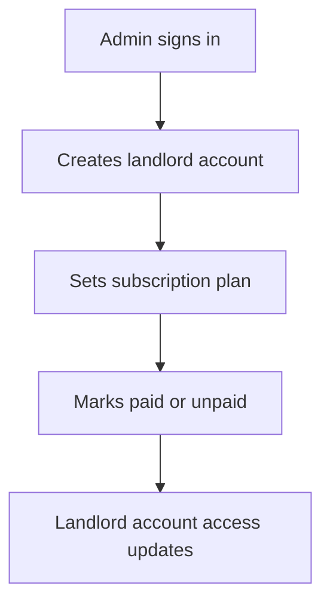
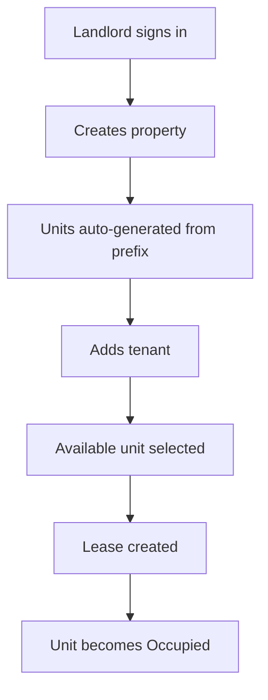
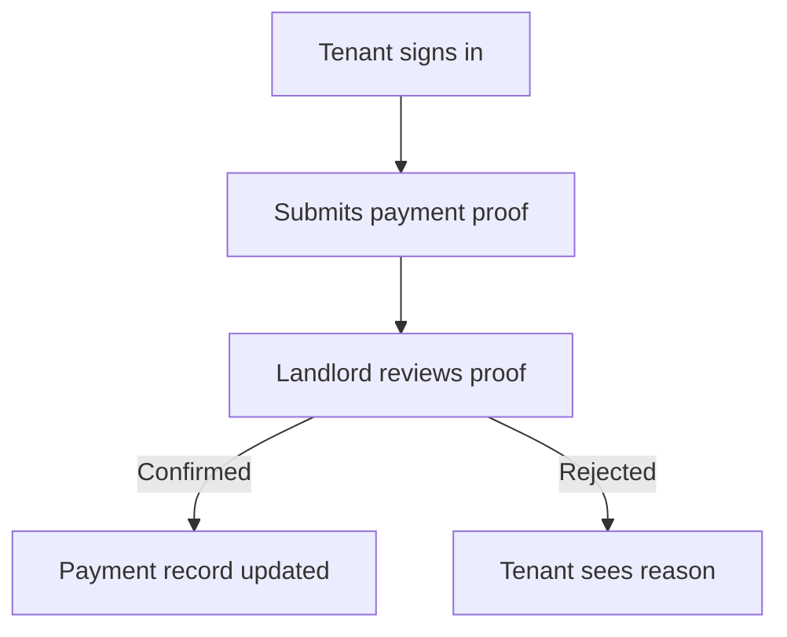
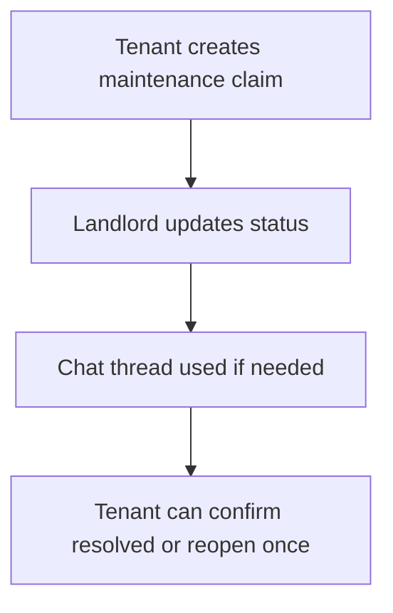

# Human-Centered Design

## Personas

### Admin
- Needs a clear view of landlord activity, subscription coverage, and system risk.
- Wants fast access to unpaid landlords, revenue totals, and high-value audit actions.

### Landlord
- Needs quick property setup, automatic unit handling, and reliable occupancy state.
- Wants to confirm proofs, follow up on late rent, manage tickets, and keep an audit trail.

### Tenant
- Needs a straightforward way to submit proof, raise maintenance issues, and see outcomes.
- Wants transparency on lease details, payment status, and landlord responses.

## Key Flows

