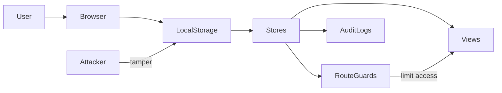

# Security Threat Model

## Assets
- Session data
- User accounts and role assignments
- Subscription records
- Property, unit, tenant, lease, payment, ticket, chat, and audit data
- Uploaded proof images stored in localStorage

## Attackers
- Curious local user with browser access
- User attempting unauthorized route access
- User tampering with localStorage values
- Malicious input attempting script injection

## Threats
- XSS through text fields
- Unauthorized access to admin, landlord, or tenant routes
- localStorage tampering to alter roles, payments, or subscriptions
- Session spoofing by editing stored session payload

## Mitigations
- Route guards enforce authentication and role checks.
- Landlord routes are additionally gated by subscription status.
- Inputs are rendered through Vue templates rather than `v-html`.
- Data access is centralized through stores and repositories for predictable writes.
- Audit logging creates visibility into critical actions and suspicious state changes.
- The app documents that localStorage is only acceptable for demo purposes, not production security.

